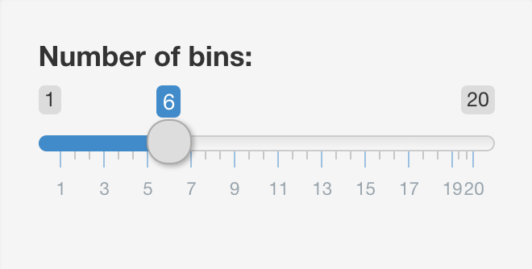
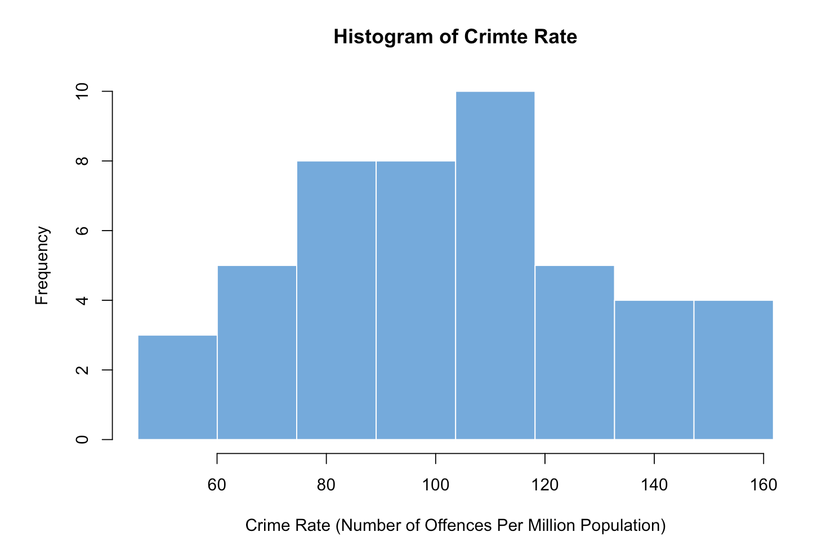
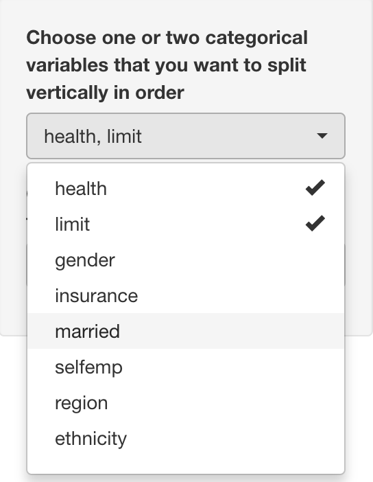
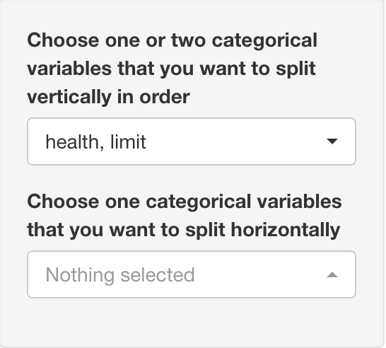
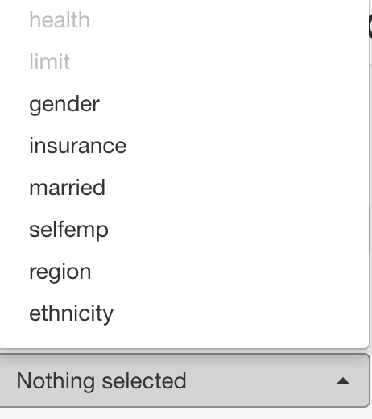

```{r setup, include=FALSE}
knitr::opts_chunk$set(echo = TRUE,warning = FALSE,message = FALSE) 
```

```{css, echo=FALSE}
pre {
  max-height: 300px;
  overflow-y: auto;
}

pre[class] {
  max-height: 350px;
}

```

```{r,echo=FALSE}
library(shiny)
library(ggplot2)
library(dplyr)
library(tidyverse)
library(AER)
library(shinyWidgets)
library(vcd)
library(RColorBrewer)
library(HH)
library(DT)
```

## Introduction
  Link for full Access: https://yifeinataliechen.shinyapps.io/shiny_tutorial/
  
  Shiny is a package in R where people could build interactive web apps. Many functions in R support the implementation of Shiny, including Rmarkdown. This tutorial aims to show shiny applications in producing interactive plots of some widely used plot formats we have learned in class, including Histogram and Barplots. More details could be found on the official website of Shiny: https://shiny.rstudio.com/. 
  
  **We run this tutorial on shinyapps.io. It may take a while for the website to display some interactive plots or reflect the changes you make. **

## Basic Structure
  First of all, we need to install the shiny package in R. 
```{r download, eval = FALSE}
install.packages("shiny")
```
  After the installation, we are going to learn the basic structure of a Shiny app. It contains 3 basic components, a user interface object, a server function, and a call to the function `shinyApp()`: 
```{r eval = FALSE}
ui <- fluidPage()
server <- function(input, output) {}
shinyApp(ui = ui, server = server)
```
 
 The user interface object controls the overall format and structure of your Shiny App, including the title and place of the main plot. The implementer decides the type of input and output contents of the Shiny App within this step. For example, using checkboxes or sliders as the interactive input component is decided during this step. The second component, the server function, uses the input to produce the output like we usually do in creating static plots. Finally, the call to the function shinyApp combines the first two components and makes the app work together. For this project's purpose, we will not go deep into the connection between Shiny and HTML codes. Instead, we primarily focus on Shiny's application in showing the plots we learned in class in a dynamic way. 

  In this tutorial, we will use three datasets, one called **crime** consisting of mostly continuous variables, one called **HealthInsurance** containing categorical variables, and one called **used data** with Likert data. 
```{r dataset, include = FALSE}
crime <- read.csv("./crime_R.csv")
head(crime)
crime <- dplyr::select_if(crime, is.numeric)
crime <- crime[, -c(15:27)]
data("HealthInsurance")
data <- read.csv("data.csv")
```

## Example

As an example of Shiny's application, let us look at the datasets we use in this tutorial. Users could choose the dataset with specific columns on their own. 

```{r column_selection, echo = FALSE}
# Complete code to show multiple datasets
ui <- fluidPage(
  titlePanel("Columns Selection of the Dataset"),
  sidebarLayout(
    sidebarPanel(
      conditionalPanel('input.dataset === "crime"',
                       checkboxGroupInput(
                         inputId = "selectedColumns1",
                         label = "Select Columns for Display: ",
                         choices = names(crime),
                         selected = names(crime))
                       ),
      conditionalPanel('input.dataset === "HealthInsurance"',
                       checkboxGroupInput(
                         inputId = "selectedColumns2",
                         label = "Select Columns for Display: ",
                         choices = names(HealthInsurance),
                         selected = names(HealthInsurance))
                       ),
      conditionalPanel('input.dataset === "data"',
                       checkboxGroupInput(
                         inputId = "selectedColumns3",
                         label = "Select Columns for Display: ",
                         choices = names(data),
                         selected = names(data))
                       )
      ),
    mainPanel(
      tabsetPanel(
        id = 'dataset',
        tabPanel("crime", DT::dataTableOutput("mytable1")),
        tabPanel("HealthInsurance", DT::dataTableOutput("mytable2")),
        tabPanel("data", DT::dataTableOutput("mytable3"))
      )
    )
  )
)

server <- function(input, output) {
  output$mytable1 <- DT::renderDataTable({
      DT::datatable(crime[, input$selectedColumns1])
  })
  output$mytable2 <- DT::renderDataTable({
      DT::datatable(HealthInsurance[, input$selectedColumns2])
  })
  output$mytable3 <- DT::renderDataTable({
      DT::datatable(data[, input$selectedColumns3])
  })
}

shinyApp(ui = ui, server = server)
```


## Displaying Continuous Variables with Shiny
For continuous variables, we will use the dataset 'crime_R.csv' obtaining from https://www.sheffield.ac.uk/mash/statistics/datasets. We will address this dataset as the **crime** dataset for the rest of this document. 

### Histogram
The first type of plot we are going to look at is the histogram. The interactive part of this plot is allowing the user to choose **the number of bins**. In the first component, the user interface object, we design the layout of our Shiny App. For example, we create the title of our Shiny App with the following line of code within the fluidPage function: 
```{r title, eval = FALSE}
ui <- fluidPage(
  titlePanel("Simple Histogram Example Changing Number of Bins")
)
```

Next, we need to define the type of interactive format of our input and its location in the plot. In this histogram, we will use a slider to change the number of bins, put it as a sidebar, and define the components of the input with the following code: 
```{r input, eval = FALSE}
ui <- fluidPage(
  ...
  sidebarLayout(
    sidebarPanel(
      # Input: Slider for the number of bins
      sliderInput(inputId = "bins",
                  label = "Number of bins:",
                  # minimum of bins shown is 1
                  min = 1,
                  # maximum of bins shown is 20
                  max = 20,
                  # default number of bins is set to 6
                  value = 6)
    )
  )
  ...
)
```

This gives us an interactive input controlling slider. 

```{r interactive_input, echo=FALSE, out.width = '50%', fig.align = "center"}

```
  
  Next, we are going to define the format of our output as plot and its location to be the main plot within the same fluidPage() function. 
  
```{r, eval = FALSE}
ui <- fluidPage(
  ...
    mainPanel(
      # Output: Histogram Plot
      plotOutput(outputId = "distPlot")
    )
)
```
  
  We could change the format of input by changing the function `sliderInput()` to the one we want, for example, `checkboxInput()`. The format of output could be changed as well. Full list of the input and output functions could be found in the official website of Shiny. The **inputId** and **outputId** listed are essential. The names you defined would be used later in the server function. 
  Then, we come to our second component, the server function where we actually produce outputs with the inputs. 
  
```{r, eval = FALSE}
ui <- fluidPage()
server <- function(input, output) {
  # In here, 'distPlot' is matched with the outputId and 'bins' is matched with the inputId in the fluidPage() function. 
  output$distPlot <- renderPlot({
    x    <- crime$CrimeRate
    bins <- seq(min(x), max(x), length.out = input$bins + 1)
    hist(x, breaks = bins, col = "#75AADB", border = "white",
         xlab = "Crime Rate (Number of Offences Per Million Population)",
         main = "Histogram of Crimte Rate")
    })
}
```
  
```{r main_panel, echo=FALSE, out.width = '50%', fig.align = "center"}

```
  
  As our last step, we put the user interface object and the server function into function using the shinyApp() function: 
```{r shinyApp, eval = FALSE}
shinyApp(ui = ui, server = server)
```
  
Combining those three components described above together, we have our first interactive histogram. 
```{r histogram, echo=FALSE}
# Complete code for histogram
ui <- fluidPage(
  titlePanel("Simple Histogram Example Changing Number of Bins"),

  sidebarLayout(

    sidebarPanel(

      sliderInput(inputId = "bins",
                  label = "Number of bins:",
                  min = 1,
                  max = 20,
                  value = 6)
    ),


    mainPanel(

      plotOutput(outputId = "distPlot")

    )
  )
)

server <- function(input, output) {

  output$distPlot <- renderPlot({

    x    <- crime$CrimeRate
    bins <- seq(min(x), max(x), length.out = input$bins + 1)

    hist(x, breaks = bins, col = "#75AADB", border = "white",
         xlab = "Crime Rate (Number of Offences Per Million Population)",
         main = "Histogram of Crimte Rate")
    })

}

shinyApp(ui = ui, server = server)
```

### Scatter Plot
Like a histogram, an interactive scatter plot could be created in a similar way. However, we need to change the input functions and the server function correspondingly. 

In displaying the scatter plot, we continue to use sliders as our interactive input format for parameters like **the size of point**, **alpha**, **type of point**, and **stroke value**. However, we introduce one new input function, which is `selectInput()`. With this function, users could choose the independent and dependent variables. 

```{r ScatterPlotShown, eval = FALSE, echo = TRUE}
ui <- fluidPage(
  ...
      # Input: select box for the x axis variable
      selectInput(inputId = "xVariable",
                  label = "Selection of x-axis variable: ",
                  list("CrimeRate", "Education", "Wage"),
                  selected = "Education"),
      
      # Input: select box for the y axis variable
      selectInput(inputId = "yVariable",
                  label = "Selection of y-axis variable: ",
                  list("CrimeRate", "Education", "Wage"),
                  selected = "CrimeRate"),
      
      # Input: Slider for the size of points 
      sliderInput(inputId = "pointSize",
                  label = "Size of points: ",
                  min = 1,
                  max = 10,
                  value = 2),
      # Input: Slider for the alpha parameter
      sliderInput(inputId = "alpha", 
                  ...), 
      # Input: Slider for the type of points
      sliderInput(inputId = "pointType",
                  ...),
      # Input: Slider for the stroke of plots (width of border of points)
      sliderInput(inputId = "strokeValue",
                  ...)
    ),
...
)

server <- function(input, output) {
  output$scatterPlot <- renderPlot({
    x    <- input$xVariable
    y    <- input$yVariable
    ggplot(crime, aes(x, y)) + 
      geom_point(size = input$pointSize, alpha = input$alpha, pch = input$pointType, stroke = input$strokeValue)
    })
}
```

```{r, echo = FALSE}
ui <- fluidPage(

  # Title of the Shiny App
  titlePanel("Simple Scatter Plot"),

  # Sidebar layout with input and output definitions ----
  sidebarLayout(

    # Sidebar panel for inputs ----
    sidebarPanel(
      
      # Input: select box for the x axis variable
      selectInput(inputId = "xVariable",
                  label = "Selection of x-axis variable: ",
                  list("CrimeRate", "Education", "Wage"),
                  selected = "Education"),
      
      # Input: select box for the y axis variable
      selectInput(inputId = "yVariable",
                  label = "Selection of y-axis variable: ",
                  list("CrimeRate", "Education", "Wage"),
                  selected = "CrimeRate"),
      
      # Input: Slider for the size of points 
      sliderInput(inputId = "pointSize",
                  label = "Size of points: ",
                  min = 1,
                  max = 10,
                  value = 2),
      # Input: Slider for the alpha parameter
      sliderInput(inputId = "alpha", 
                  label = "Value of 'Alpha' parameter: ",
                  min = 0, 
                  max = 1,
                  value = 0.5), 
      
      # Input: Slider for the type of points
      sliderInput(inputId = "pointType",
                  label = "Type of Points: ",
                  min = 1, 
                  max = 25, 
                  value = 20),
      
      # Input: Slider for the stroke of plots (width of border of points)
      sliderInput(inputId = "strokeValue",
                  label = "Stoke Value: ", 
                  min = 1, 
                  max = 10, 
                  value = 1)
    ),

    # Main panel for displaying outputs ----
    mainPanel(

      # Output: Histogram ----
      plotOutput(outputId = "scatterPlot")

    )
  )
)
# Define server logic required to draw a histogram ----
server <- function(input, output) {
  output$scatterPlot <- renderPlot({
    x    <- input$xVariable
    y    <- input$yVariable
    ggplot(crime, aes_string(x, y)) + 
      geom_point(size = input$pointSize, alpha = input$alpha, pch = input$pointType, stroke = input$strokeValue)
    })

}

# Putting everything together
shinyApp(ui = ui, server = server)
```

The above scatter plot is used to illustrate different input functions that the implementor could try out. To have a better illustration in practice, users should implement the appropriate input functions for their purposes. 

## Displaying Categorical Variables with Shiny

  In the lectures, we have learned to visualize categorical variables by making plots such as bar charts and mosaic plots. In this section, we will use functions in **shiny** package accompanied with plotting functions that we have learned in **ggplot2** and **vcd** packages to make interactive graphs and display categorical variables in the **HealthInsurance** dataset in the **AER** package.

### Interactive Bar Chart
  The **HealthInsurance** dataset within the **AER** package contains data generated from the Medical Expenditure Panel Survey conducted in 1996. We will first make an interactive bar chart to help visualize each categorical variable in this dataset. In this interactive bar chart, users are free to select the categorical variable and color they want to use.

  We will construct the interactive graph by first adding two select boxes that help users to select the categorical variables they want to plot and their choice of color for the bars to the sidebar panel. To achieve this, we apply `selectInput()` to create select boxes in `sidebarPanel()`.
```{r,echo=TRUE,eval=FALSE}
#create select box for variable selection
selectInput(inputId = "var",
            label = "Choose the Categorical Variable",
            choices = c("health","limit","gender","insurance","married","selfemp","region","ethnicity","education")),
#create select box for color selection
selectInput(inputId = "col",
            label = "Choose the Color",
            choices = list("grey"="#808080","lightblue"="lightblue","green"="#CCFF99","pink"="#FFCCE5"),
            selected = "grey")
```

  We then pass what the users select in the input panel to the server function and use `renderPlot()` in the **shiny** package along with `geom_col()` in the **ggplot2** package to construct the desired bar chart.
```{r,echo=TRUE,eval = FALSE}
  output$bar <- renderPlot({
    #load data
    data("HealthInsurance")
    HealthInsurance$ethnicity <- fct_infreq(HealthInsurance$ethnicity)
    #use ggplot2 to plot barchart
    ggplot(HealthInsurance,aes_string(input$var))+
      geom_bar(fill = input$col)+
      theme_bw()

    })
```

**Now we obtain our interactive bar chart as below:**
```{r echo=FALSE}
#complete code shown as below:

ui <- fluidPage(

  # App title ----
  titlePanel("Build Your Own Bar Chart for the 'HealthInsurance' Dataset"),

  # Sidebar layout with input and output definitions ----
  sidebarLayout(
    # Sidebar panel for inputs ----
    sidebarPanel(

      selectInput(inputId = "var",
                  label = "Choose the Categorical Variable",
                  choices = c("health","limit","gender","insurance","married","selfemp","region","ethnicity","education")),
      selectInput(inputId = "col",
                  label = "Choose the Color",
                  choices = list("grey"="#808080","lightblue"="lightblue","green"="#CCFF99","pink"="#FFCCE5"),
                  selected = "grey")),

    # Main panel for displaying outputs ----
    mainPanel(
      
      h3("Bar Chart of Your Chosen Variable"),
      # Output: Bar Chart ----
      plotOutput(outputId = "bar"))

    
  )  
)

# Define server logic required to draw a histogram ----
server <- function(input, output) {
  
  output$bar <- renderPlot({
    
    data("HealthInsurance")
    HealthInsurance$gender <- fct_infreq(HealthInsurance$gender)
    HealthInsurance$region <- fct_infreq(HealthInsurance$region)
    HealthInsurance$ethnicity <- fct_infreq(HealthInsurance$ethnicity)
    ggplot(HealthInsurance,aes_string(input$var))+
      geom_bar(fill = input$col)+
      theme_bw()

    })

}

# Create Shiny app ----
shinyApp(ui = ui, server = server)
```

### Interactive Mosaic Plot

  We now apply features in **shiny** to display multivariate categorical data. To do this, we combine functions in **shiny** and functions in **vcd** package to draw an interactive mosaic plot of **HealthInsurance** dataset. To play with the mosaic plot, users can select at most two categorical variables that they want to split vertically and one categorical variable that they want to split horizontally. The mosaic plot is filled by using color palette **PuBu**.

  To build the select box in the sidebar panel of this mosaic plot, we use function `pickerInput()` and `updatePickerInput()` instead of `selectInput()`. `pickerInput()` build a select box for user to select provided options but it's more easy to control users' input than `selectInput()`. By adding the argument `options = list('max-options' = 2)` in `pickerInput()`, we limit the users' selection to at most two. `updatePickerInput()` is a function to control user input and change the value of a picker input on the client from the server-side. In this example, we apply `updatePickerInput()` in the sever to control users' input for the variable that they want to split horizontally. Namely, variables that users choose to split vertically cannot be chosen again for the horizontal cut.

**From user interface:**
```{r,echo=TRUE,eval=FALSE}
sidebarPanel(
      pickerInput(inputId = "v",
              label = "Choose one or two categorical variables that you want to split vertically in order",
              choices = c("health","limit","gender","insurance","married","selfemp","region","ethnicity","education"),
              multiple = TRUE,
              options = list(`max-options` = 2)),
      pickerInput(inputId = "h",
              label = "Choose one categorical variables that you want to split horizontally",
              choices = c("health","limit","gender","insurance","married","selfemp","region","ethnicity","education"),
              multiple = TRUE,
              options = list(`max-options` = 1)
              )
    )
```

**From the server-side:**
```{r,echo=TRUE, eval=FALSE}
#create a vector containing variable names
catevar <- c("health","limit","gender","insurance","married","selfemp","region","ethnicity","education")
server <- function(input, output, session) {
  observe({
    #get the input value
    x <- input$v
    #get the position of selected variables
    disabled_choices1 <- catevar %in% x
    #control picker input 
    updatePickerInput(session, "h",
      choices = catevar,
      choicesOpt = list(
        disabled = disabled_choices1,
        style = ifelse(disabled_choices1,
                       yes = "color: rgba(119, 119, 119, 0.5);",
                       no = "")))
  })
}
```

**The select boxes created by above code:**

```{r pressure, echo=FALSE, out.width = '30%'}




```


  After getting the user input, we rephrase it under a reactive context such that it can be used as an eligible argument in the function `mosaic()`. `reactive()` provides an reactive context to access user input. The output of the following code will be in the form of **var_horizontal ~ var_vertical1( +var_vertical2)**, which is an eligible argument passed into `mosaic()` to conduct the corresponding mosaic plot.

```{r,echo=TRUE,eval=FALSE}
  vertical <- reactive({
    if(length(input$v)==2){
      paste(input$v[1],"+",input$v[2])
    }else{
      input$v
    }
  })
  formulaText <- reactive({
    if(length(input$h==1)&&length(input$v)==0){
      paste("~",input$h)
    }else{
      paste(input$h,"~", vertical())
    }
  })
```

Lastly, we apply `renderPlot()` and `mosaic()` to conduct the mosaic plot of chosen categorical variables:
```{r,echo=FALSE}
#complete code for the mosaic plot

#get the variable names of categorical variable
catevar <- c("health","limit","gender","insurance","married","selfemp","region","ethnicity","education")
#get color from the color palette "PuBu"
PuBucol<-brewer.pal(8,"PuBu")

ui <- fluidPage(
  titlePanel("Build Your Own Mosaic Plot for the 'HealthInsurance' Dataset"),

  sidebarLayout(
    sidebarPanel(
      pickerInput(inputId = "v",
              label = "Choose one or two categorical variables that you want to split vertically in order",
              choices = c("health","limit","gender","insurance","married","selfemp","region","ethnicity","education"),
              multiple = TRUE,
              options = list(`max-options` = 2),
              selected = "health"),
      pickerInput(inputId = "h",
              label = "Choose one categorical variables that you want to split horizontally",
              choices = c("health","limit","gender","insurance","married","selfemp","region","ethnicity","education"),
              multiple = TRUE,
              options = list(`max-options` = 1))
      
    ),
    mainPanel(
    h3("Mosaic Plot of Your Chosen Variables"),
    br(),
    #if at least one variable is selected
    conditionalPanel(condition="!is.null(input.v) || !is.null(input$h)",
                     plotOutput(outputId = "mosaic"))
    )
  )
)

server <- function(input, output, session) {
  
  observe({
    x <- input$v
    disabled_choices1 <- catevar %in% x
    #update options in the select box for horizontally split variable
    updatePickerInput(session, "h",
      choices = catevar,
      choicesOpt = list(
        disabled = disabled_choices1,
        style = ifelse(disabled_choices1,
                       yes = "color: rgba(119, 119, 119, 0.5);",
                       no = ""))
    )
    

  })
  #rephrase userinput under reactive context
  vertical <- reactive({
    if(length(input$v)==2){
      paste(input$v[1],"+",input$v[2])
    }else{
      input$v
    }
  })
  formulaText <- reactive({
    if(length(input$h==1)&&length(input$v)==0){
      paste("~",input$h)
    }else{
      paste(input$h,"~", vertical())
    }

  })
 #render the mosaic plot using mosaic() in the 'vcd' package
  output$mosaic <-renderPlot({
    #if at least one variable is selected
    if(!is.null(input$v) || !is.null(input$h)){
      vcd::mosaic(as.formula(formulaText()),
            direction=c(rep("v",length(input$v)),rep("h",length(input$h))),
            highlighting_fill=PuBucol[1:length(levels(HealthInsurance[,input$h]))],
            rot_labels = c(left = 55),
            abbreviate_labs=6,
            #offset_labels = c(left = 1),
            margins = c(5,5,5,5),
            data=HealthInsurance)
     }
  })

}

shinyApp(ui, server)

```


### Displaying Likert Data

  In this section, we will display Likert data in an interactive way using **shiny**. Users are free to choose visualizing Likert data by grouped bar chart, stacked bar chart, or diverging stacked bar chart. The data used for visualization contain answers to the Humor Styles Questionnaire. For this example, we only focus on the first five questions in the questionnaire. 
Data Source: https://openpsychometrics.org/_rawdata/

  The method we use in this example to connect users' choice of graph with displayed output is `conditionalPanel()`. We condition on the ID of each choice of radio button and render corresponding plot of users' choice.

```{r,echo = TRUE,eval=FALSE}
#condition on user input and output corresponding type of plot
mainPanel(
      conditionalPanel(condition="input.type==1",plotOutput("group")),
      conditionalPanel(condition="input.type==2",plotOutput("barchart")),
      conditionalPanel(condition="input.type==3",plotOutput("diverge"))
   )

```

We then use `renderPlot()` as before to generate different types of graphs and obtain the desired interactive plot:

**grouped bar chart**
```{r,eval=FALSE}
#generate grouped bar chart
output$group <- renderPlot(
  useddata %>%pivot_longer(cols = !Question, names_to = "attitude",values_to ="count") %>%
    mutate(attitude=fct_relevel(attitude,"Never or very rarely true","Rarely true","Sometimes true","Often true","Very often or always true"))%>%
    ggplot(aes(fill=attitude, x=Question, y=count)) + 
    geom_col(position="dodge")+
    scale_fill_manual(values = c("#f26085","#f495a9","#e5e5e7","#a1abea","#7389ed"))+
    theme_bw()+
    ggtitle("Answers to the Humor Styles Questionnair")
)
```

**stacked bar chart**
```{r,eval=FALSE}
#generate stacked bar chart
output$barchart<-renderPlot(
    useddata %>% pivot_longer(cols = !Question, names_to = "attitude",values_to ="count") %>%
      mutate(attitude=fct_relevel(attitude,"Never or very rarely true","Rarely true","Sometimes true","Often true","Very often or always true"))%>%
      ggplot(aes(y=count,x=Question,fill=fct_rev(attitude)))+
      geom_col()+
      coord_flip()+
      theme(legend.position="bottom")+
      scale_fill_manual(values = c("#7389ed","#a1abea","#e5e5e7","#f495a9","#f26085"))+
      theme_bw()+
      guides(fill = guide_legend(reverse = TRUE))+
      xlab("Question")+
      ggtitle("Answers to the Humor Styles Questionnaire")
) 
```

**diverging stacked bar chart**
```{r,eval=FALSE}
#generate diverging stacked bar chart
output$diverge <- renderPlot(
  likert(Question ~ .,useddata,
      as.percent=TRUE,
      main='Answers to the Humor Styles Questionnaire',
      ylab=NULL)
)
```

**Desired Plot:**
```{r,echo=FALSE}
data <- read.csv("data.csv")
useddata <- data[,1:5]
useddata <- as.data.frame(apply(useddata,2,as.factor),stringsAsFactors = TRUE)
useddata <- mutate_if(useddata, is.factor,~fct_recode(.,"Never or very rarely true"="1","Rarely true"="2","Sometimes true"="3","Often true"="4","Very often or always true"="5"))
table <- apply(useddata,2,table)
useddata<-as.data.frame(t(table))
useddata <- useddata[,c("Never or very rarely true","Rarely true","Sometimes true","Often true","Very often or always true")]
useddata$Question <- c("Q1","Q2","Q3","Q4","Q5")


ui <- fluidPage(
  titlePanel("Choose Your Own Way to Display Likert Data"),
  
  sidebarLayout(
    sidebarPanel(
      radioButtons("type",
                   h3("Type of Graph"),
                   choices = list("Grouped Bar Chart" =1,
                                  "Stacked Bar Chart" = 2, 
                                  "Diverging Stacked Bar Chart" = 3),selected = 2)
      
    ),
    
    mainPanel(
      conditionalPanel(condition="input.type==1",plotOutput("group")),
      conditionalPanel(condition="input.type==2",plotOutput("barchart")),
      conditionalPanel(condition="input.type==3",plotOutput("diverge")),
      h4("Q1. I usually don't laugh or joke around much with other people."),
      h4("Q2. If I am feeling depressed, I can usually cheer myself up with humor."),
      h4("Q3. If someone makes a mistake, I will often tease them about it."),
      h4("Q4. I let people laugh at me or make fun at my expense more than I should."),
      h4("Q5. I don't have to work very hard at making other people laugh.")
      
    )
  )
)

server<-function(input, output, session) {
  
  #generate grouped bar chart
  output$group <- renderPlot(
    useddata %>%pivot_longer(cols = !Question, names_to = "attitude",values_to ="count") %>%
      mutate(attitude=fct_relevel(attitude,"Never or very rarely true","Rarely true","Sometimes true","Often true","Very often or always true"))%>%
      ggplot(aes(fill=attitude, x=Question, y=count)) + 
      geom_col(position="dodge")+
      scale_fill_manual(values = c("#f26085","#f495a9","#e5e5e7","#a1abea","#7389ed"))+
      theme_bw()+
      ggtitle("Answers to the Humor Styles Questionnair")
  )
  
  #generate stacked bar chart
  output$barchart<-renderPlot(
      useddata %>% pivot_longer(cols = !Question, names_to = "attitude",values_to ="count") %>%
        mutate(attitude=fct_relevel(attitude,"Never or very rarely true","Rarely true","Sometimes true","Often true","Very often or always true"))%>%
        ggplot(aes(y=count,x=Question,fill=fct_rev(attitude)))+
        geom_col()+
        coord_flip()+
        theme(legend.position="bottom")+
        scale_fill_manual(values = c("#7389ed","#a1abea","#e5e5e7","#f495a9","#f26085"))+
        theme_bw()+
        guides(fill = guide_legend(reverse = TRUE))+
        xlab("Question")+
        ggtitle("Answers to the Humor Styles Questionnaire")
  ) 
  
  #generate diverging stacked bar chart
  output$diverge <- renderPlot(
    likert(Question ~ .,useddata,
       as.percent=TRUE,
       main='Answers to the Humor Styles Questionnaire',
       ylab=NULL)
  )
}

shinyApp(ui = ui, server = server)
```


